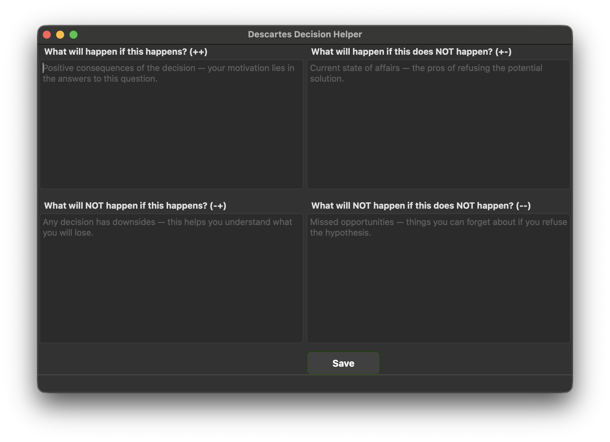

# Descartes Decision Helper

Descartes' Square — Decision Helper


## 📘 How it Works
The application implements the **Descartes Square** decision-making technique. It helps you look at a problem from four different angles:

1. **What will happen if this happens? (++)** — Gains and motivation.
2. **What will happen if this does NOT happen? (+-)** — Benefits of the current state (status quo).
3. **What will NOT happen if this happens? (-+)** — Risks and what you will lose.
4. **What will NOT happen if this does NOT happen? (--)** — Potential missed opportunities.

The program parses your answers line by line. If you put an importance score (**1 to 5**) after a space at the end of a line, the app will include it in the weighted calculation to provide a final verdict.

---

## 🌍 Languages
The application currently supports:
* **Russian (RU)** 
* **English (EN)** 

---

## 🛠 How to Build (Executable)
To create a standalone executable (`.exe`, `.app`, or binary) so that others can run the program without installing Python, use **PyInstaller**.

### 1. Install PyInstaller
```bash
python -m PyInstaller --noconsole --onedir --add-data "ui.ui:." main.py
```